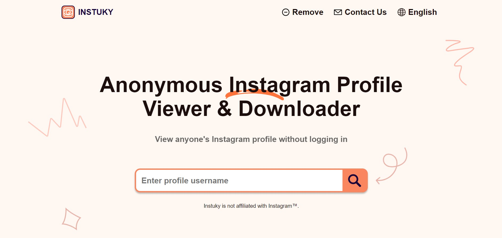

<h1 align="center"> Instuky: Anonymous Instagram Viewer and Downloader</h1>

<a href="https://instuky.com">Instuky</a> stands as a groundbreaking online solution, enabling users to anonymously access Instagram profiles and freely download photos and videos. This innovative platform empowers you to navigate through any Instagram profile discreetly, ensuring your presence remains undetected and granting you the flexibility to explore without concern for your identity exposure. Whether you aim to stay updated on a friend's activities, investigate a potential romantic connection, or casually peruse your favorite celebrities' profiles, Instuky emerges as the ideal solution for all your Instagram viewing requirements.

Beyond anonymous viewing, Instuky boasts a handy photo and video downloader feature. Save your favorite Instagram content directly to your device effortlessly. Whether it's a cherished photo from a friend's feed or an inspiring video from a popular influencer, Instuky simplifies the process of building a personal collection. The best part? All these features come at no cost, making Instuky an invaluable tool for Instagram enthusiasts looking to elevate their browsing experience.

---

## Key Features of Instuky:

- Anonymous Story Viewing: Instuky recently launched as a platform for anonymous Instagram Stories browsing, allowing users to peruse content incognito.

- High-Quality Profile and Stories Viewer: Enjoy ad-free viewing of stories, coupled with the ability to download Instagram videos and images.

- Trending Feature: Discover popular Instagram content conveniently in one place.

---

## Advantages of Instuky:

- Download Capability: Save Instagram images and videos directly to your device.

- Privacy: Explore others' Instagram stories without leaving a trace.

- No Registration Required: Watch stories without the need for an Instagram account.

- Cost-Free: Instuky by stories offers accessibility to users without any payment requirements.

---

## Safety Concerns:

- The safety of using Instuky remains a topic of debate. While some consider it an anonymous and secure tool, others caution about potential privacy compromises.

- Instuky relies on Instagram's official API for content, avoiding any payment requirements or rights infringement. Users can browse Instagram content incognito, accessing profiles, photos, stories, locations, and tags. However, it does not support private profiles.

- Users are advised to exercise caution regarding potential copyright issues when downloading content through Instuky. Though not foolproof, Instuky is generally acknowledged as a safe and useful tool for various Instagram purposes. To explore its features, visit https://instuky.com and decide for yourself!
